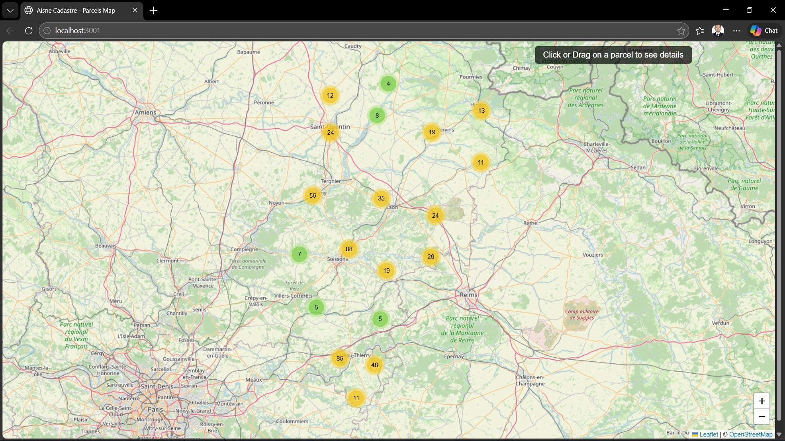
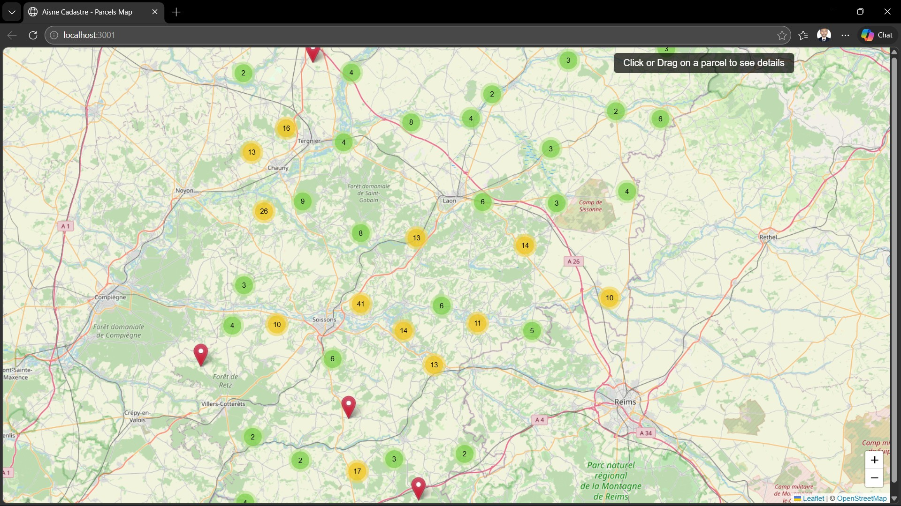
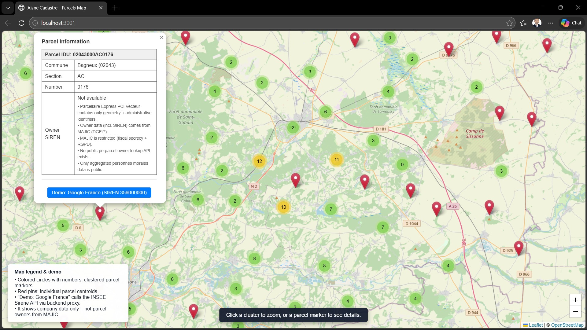
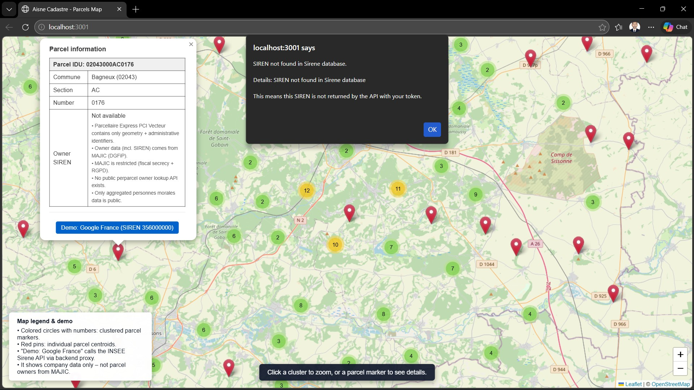
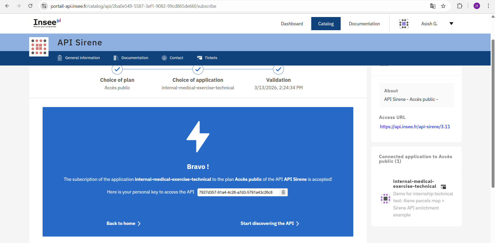
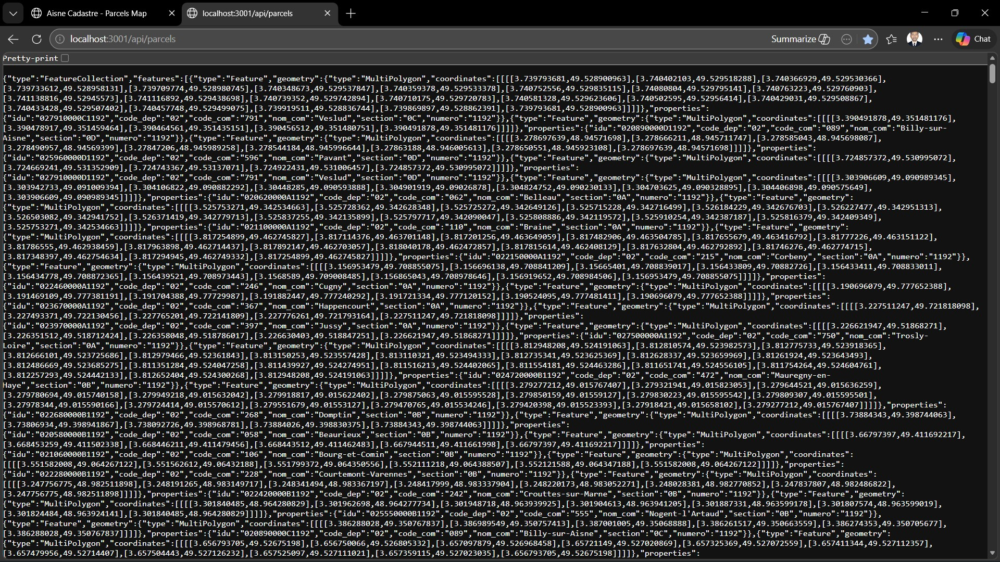
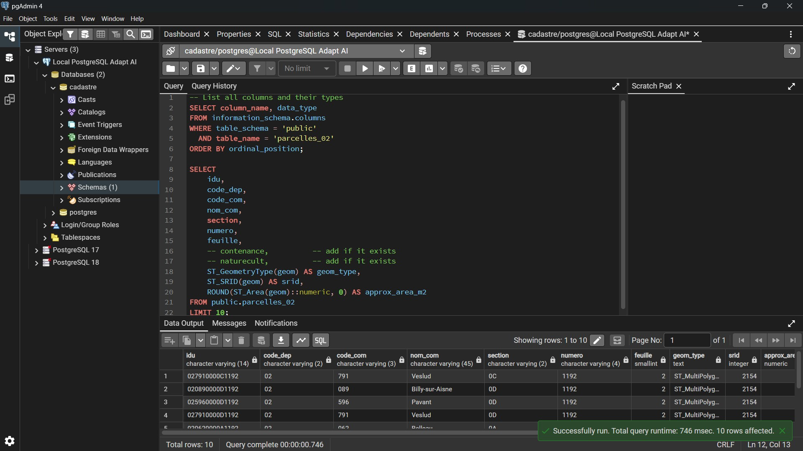

## **Aisne Cadastre Viewer – Parcellaire Express Map**

Full‑stack GIS web application displaying cadastral parcels (plots) for the Aisne department (02) using **Parcellaire Express PCI Vecteur** public data.

Interactive Leaflet map with OpenStreetMap background, clustered parcel markers, clickable popups, and a demo of the INSEE Sirene API for company data enrichment.

---

### Quick start

1. **Clone & install**
   - `git clone <this-repo-url>`
   - `cd internal-medical-exercise-technical`
   - `cd backend && npm install`
   - `cd ..`
2. **Configure**
   - Create a `.env` file (see **Environment variables** below).
3. **Import Parcellaire Express data**
   - Use `shp2pgsql` once to load the IGN Parcellaire Express shapefile into the `parcelles_02` table (see **Database & data import**).
4. **Run**
   - `node backend/server.js`
   - Open `http://localhost:3001` in your browser.

Built as a technical exercise to demonstrate:

- **Geospatial data import & management** with PostGIS
- **REST API** with Node.js / Express
- **Frontend mapping** with Leaflet + marker clustering
- **Honest handling of restricted cadastral data** (MAJIC / SIREN)

### Screenshots















### Features

- **Dynamic map centered on Aisne** (department 02)
- **Parcels shown as clustered markers** (using parcel centroids for performance)
- **Click a parcel → popup** with IDU, commune, section, number
- **Transparent note** in the popup explaining why owner SIREN is not available
- **Bonus demo**: real INSEE Sirene API call for a valid SIREN (via backend proxy endpoint `/api/sirene/:siren`)

### Tech Stack

- **Backend**: Node.js + Express + `pg`
- **Database**: PostgreSQL 15+ with PostGIS extension (tested on PostgreSQL 15/16)
- **Frontend**: HTML + JavaScript + Leaflet.js + Leaflet.markercluster
- **Data source**: IGN Parcellaire Express PCI Vecteur (public, open data)
- **Bonus API**: INSEE Sirene V3.11 (public plan – free Bearer token)

### Project structure

- `backend/` – Express API (`/api/parcels`, `/api/parcels-points`, `/api/sirene/:siren`) and database access
- `frontend/` – Leaflet map UI (`index.html`, `CSS.css`)
- `screenshots/` – Screenshots used in this README

### Prerequisites

- Node.js 18+ (needed for native `fetch` in the backend)
- PostgreSQL 15+ with PostGIS installed
- `shp2pgsql` tool (included with PostGIS) to import the Parcellaire Express shapefiles
- Git & a web browser

### Environment variables

Create a `.env` file at the project root with at least:

```bash
PGHOST=localhost
PGPORT=5432
PGDATABASE=your_database
PGUSER=your_user
PGPASSWORD=your_password

PORT=3001
SIRENE_API_TOKEN=your_insee_sirene_bearer_token
```

The backend uses `SIRENE_API_TOKEN` to call the INSEE Sirene V3.11 API through the `/api/sirene/:siren` proxy.

### Database & data import (Parcellaire Express)

1. **Enable PostGIS** in your PostgreSQL database:

```sql
CREATE EXTENSION IF NOT EXISTS postgis;
```

2. **Import Parcellaire Express PCI Vecteur** for Aisne (02) into a table named `parcelles_02`, for example:

```bash
shp2pgsql -I -s 2154 parcellaire_express_02.shp public.parcelles_02 | psql -h localhost -d your_database -U your_user
```

The backend expects a `geom` geometry column on `parcelles_02` and uses it to serve:
- `/api/parcels` – polygon geometries (GeoJSON, EPSG:4326)
- `/api/parcels-points` – centroids of parcels (GeoJSON, EPSG:4326) for marker clustering

### Running the app

```bash
cd backend
npm install   # if not already done
node server.js
```

Then open `http://localhost:3001` in your browser.

#### Quick checks

- Open `http://localhost:3001/api/parcels` in your browser to verify that the backend returns parcel GeoJSON from the `parcelles_02` table.
- If you see a JSON `FeatureCollection` with parcel properties (idu, commune, section, number), the database import and API are working correctly.

### Notes on cadastral / SIREN data

- **Parcellaire Express PCI Vecteur** contains parcel geometry and administrative identifiers (IDU, commune, section, number).
- **Owner information and SIREN** come from MAJIC (DGFiP), which is **restricted** (fiscal secrecy + RGPD).
- There is **no public per‑parcel owner lookup API**; only aggregated information about **personnes morales** is public.
- This project therefore **does not expose parcel‑level owners or SIREN**, only a **separate Sirene demo** via `/api/sirene/:siren`.

### Sirene demo

- Each parcel popup includes a **“Demo: Google France (SIREN 356000000)”** button.
- Clicking it calls the backend proxy at `http://localhost:3001/api/sirene/356000000`.
- The backend forwards the request to the **INSEE Sirene V3.11** API using your `SIRENE_API_TOKEN` and returns:
  - SIREN
  - Company name
  - Legal form
  - Address, postal code, city
  - Creation date

This keeps your Sirene API token on the backend and demonstrates safe enrichment of open cadastral data with public company information, without ever exposing restricted owner data.
